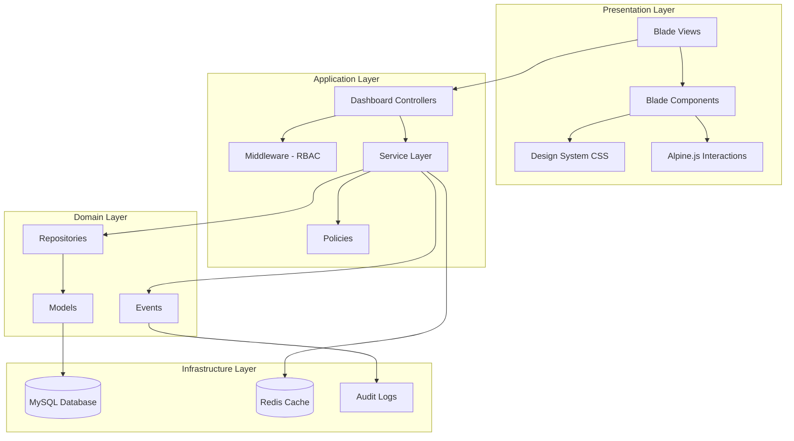

# Design Document: Dashboard System Rebuild

## Overview

This design document outlines the architecture and implementation approach for rebuilding the Tulip Store dashboard system. The new system will replace all existing dashboard code with a unified, modern SaaS-style interface featuring:

- A premium design system with shared components
- Role-based access control (RBAC) for 7 user roles
- Real-time data integration with the store frontend
- Clean architecture using service and repository patterns
- Comprehensive audit logging for compliance

The system is built on Laravel 10+ with Blade templates, using a component-based architecture for maximum reusability.

## Architecture

### High-Level Architecture



### Directory Structure

```
app/
├── Http/
│   ├── Controllers/
│   │   └── Dashboard/
│   │       ├── AdminDashboardController.php
│   │       ├── ITDashboardController.php
│   │       ├── CSDashboardController.php
│   │       ├── HRDashboardController.php
│   │       ├── DeliveryDashboardController.php
│   │       ├── StoreOwnerDashboardController.php
│   │       └── FinanceDashboardController.php
│   └── Middleware/
│       └── DashboardRoleMiddleware.php
├── Services/
│   └── Dashboard/
│       ├── AdminDashboardService.php
│       ├── MetricsService.php
│       ├── ExportService.php
│       └── AuditService.php
├── Repositories/
│   ├── Contracts/
│   │   ├── OrderRepositoryInterface.php
│   │   ├── UserRepositoryInterface.php
│   │   └── ...
│   └── Eloquent/
│       ├── OrderRepository.php
│       ├── UserRepository.php
│       └── ...
└── Policies/
    └── DashboardPolicy.php

resources/
├── css/
│   └── dashboard/
│       ├── tokens.css
│       ├── components.css
│       └── utilities.css
└── views/
    └── dashboard/
        ├── layouts/
        │   └── app.blade.php
        ├── components/
        │   ├── sidebar.blade.php
        │   ├── topbar.blade.php
        │   ├── stat-card.blade.php
        │   ├── data-table.blade.php
        │   ├── modal.blade.php
        │   ├── badge.blade.php
        │   └── button.blade.php
        ├── admin/
        ├── it/
        ├── cs/
        ├── hr/
        ├── delivery/
        ├── store-owner/
        └── finance/
```

## Components and Interfaces

### Middleware: DashboardRoleMiddleware

```php
interface DashboardRoleMiddlewareInterface
{
    /**
     * Check if user has required role(s) for dashboard access
     * @param Request $request
     * @param Closure $next
     * @param string ...$roles Required roles (OR logic)
     * @return Response
     */
    public function handle(Request $request, Closure $next, string ...$roles): Response;
}
```

### Service Layer Interfaces

```php
interface DashboardServiceInterface
{
    public function getKPIMetrics(User $user): array;
    public function getChartData(User $user, string $period): array;
    public function getTableData(User $user, array $filters, int $page, int $perPage): LengthAwarePaginator;
}

interface MetricsServiceInterface
{
    public function calculateRevenue(Carbon $start, Carbon $end, ?int $storeId = null): float;
    public function calculateOrderCount(Carbon $start, Carbon $end, ?int $storeId = null): int;
    public function calculateGrowthPercentage(float $current, float $previous): float;
    public function formatCurrency(float $amount, string $currency = 'USD'): string;
    public function formatPercentage(float $value): array; // Returns ['value' => string, 'color' => string, 'icon' => string]
}

interface ExportServiceInterface
{
    public function exportToCSV(Collection $data, array $columns, string $filename): StreamedResponse;
    public function exportToPDF(Collection $data, array $columns, string $template): Response;
    public function queueLargeExport(Collection $data, array $columns, string $format, User $user): void;
}

interface AuditServiceInterface
{
    public function log(string $action, string $resourceType, int $resourceId, array $metadata = []): AuditLog;
    public function getAuditLogs(array $filters, int $page, int $perPage): LengthAwarePaginator;
    public function serializeEntry(AuditLog $entry): string;
    public function deserializeEntry(string $json): AuditLog;
}
```

### Repository Interfaces

```php
interface OrderRepositoryInterface
{
    public function findById(int $id): ?Order;
    public function getForStore(int $storeId, array $filters = []): LengthAwarePaginator;
    public function getAll(array $filters = []): LengthAwarePaginator;
    public function getTotalRevenue(Carbon $start, Carbon $end, ?int $storeId = null): float;
    public function getOrderCount(Carbon $start, Carbon $end, ?int $storeId = null): int;
}

interface UserRepositoryInterface
{
    public function findById(int $id): ?User;
    public function search(string $query, array $filters = []): LengthAwarePaginator;
    public function getByRole(string $role): Collection;
    public function getTotalCount(): int;
}

interface AuditLogRepositoryInterface
{
    public function create(array $data): AuditLog;
    public function getFiltered(array $filters, int $page, int $perPage): LengthAwarePaginator;
    // Note: No update or delete methods - audit logs are immutable
}
```

### Blade Component Interfaces

```php
// Stat Card Component Props
@props([
    'title' => '',           // Card title
    'value' => '',           // Main value to display
    'change' => null,        // Percentage change (float)
    'changeLabel' => '',     // Label for change period
    'icon' => '',            // FontAwesome icon class
    'color' => 'primary',    // Color theme: primary, success, warning, error
])

// Data Table Component Props
@props([
    'columns' => [],         // Array of column definitions
    'data' => [],            // Paginated data
    'searchable' => true,    // Enable search
    'sortable' => true,      // Enable sorting
    'exportable' => false,   // Show export buttons
    'emptyMessage' => '',    // Message when no data
])

// Badge Component Props
@props([
    'type' => 'default',     // default, success, warning, error, info
    'size' => 'md',          // sm, md, lg
])

// Button Component Props
@props([
    'type' => 'button',      // button, submit, reset
    'variant' => 'primary',  // primary, secondary, danger, ghost
    'size' => 'md',          // sm, md, lg
    'disabled' => false,
    'loading' => false,
])
```

## Data Models

### AuditLog Model

```php
class AuditLog extends Model
{
    protected $fillable = [
        'user_id',
        'action',           // create, update, delete, export, approve
        'resource_type',    // order, user, product, transaction, etc.
        'resource_id',
        'metadata',         // JSON: old_values, new_values, etc.
        'ip_address',
        'user_agent',
    ];

    protected $casts = [
        'metadata' => 'array',
        'created_at' => 'datetime',
    ];

    // Prevent updates and deletes
    public static function boot()
    {
        parent::boot();
        
        static::updating(function ($model) {
            throw new ImmutableRecordException('Audit logs cannot be modified');
        });
        
        static::deleting(function ($model) {
            throw new ImmutableRecordException('Audit logs cannot be deleted');
        });
    }
}
```

### Store Model (Enhanced)

```php
class Store extends Model
{
    protected $fillable = [
        'user_id',          // Owner
        'name',
        'slug',
        'description',
        'logo',
        'status',           // active, suspended, pending
        'commission_rate',  // Platform fee percentage
        'settings',         // JSON
    ];

    protected $casts = [
        'settings' => 'array',
        'commission_rate' => 'decimal:2',
    ];

    public function owner(): BelongsTo
    {
        return $this->belongsTo(User::class, 'user_id');
    }

    public function products(): HasMany
    {
        return $this->hasMany(Product::class);
    }

    public function calculateRevenue(Carbon $start, Carbon $end): float
    {
        return $this->orders()
            ->whereBetween('created_at', [$start, $end])
            ->where('status', 'completed')
            ->sum('total_amount');
    }

    public function calculateEarnings(Carbon $start, Carbon $end): float
    {
        $revenue = $this->calculateRevenue($start, $end);
        return $revenue * (1 - $this->commission_rate / 100);
    }
}
```

### FinancialTransaction Model (Enhanced)

```php
class FinancialTransaction extends Model
{
    protected $fillable = [
        'type',             // income, expense, payout, refund
        'amount',
        'currency',
        'status',           // pending, approved, completed, cancelled
        'reference_type',   // order, payout, refund
        'reference_id',
        'store_id',
        'approved_by',
        'approved_at',
        'is_immutable',
        'metadata',
    ];

    protected $casts = [
        'amount' => 'decimal:2',
        'metadata' => 'array',
        'approved_at' => 'datetime',
        'is_immutable' => 'boolean',
    ];

    public static function boot()
    {
        parent::boot();
        
        static::updating(function ($model) {
            if ($model->getOriginal('is_immutable')) {
                throw new ImmutableRecordException('Approved financial records cannot be modified');
            }
        });
    }

    public function approve(User $approver): void
    {
        $this->update([
            'status' => 'approved',
            'approved_by' => $approver->id,
            'approved_at' => now(),
            'is_immutable' => true,
        ]);
    }
}
```

## Correctness Properties

*A property is a characteristic or behavior that should hold true across all valid executions of a system-essentially, a formal statement about what the system should do. Properties serve as the bridge between human-readable specifications and machine-verifiable correctness guarantees.*

Based on the prework analysis, the following correctness properties have been identified:

### Property 1: Role-Based Access Control Enforcement
*For any* user without the required role and *for any* protected dashboard route, the middleware SHALL deny access and return HTTP 403 status.
**Validates: Requirements 2.1, 2.2**

### Property 2: Multi-Role Access Grant
*For any* user with multiple roles, the user SHALL have access to all dashboards corresponding to each of their assigned roles.
**Validates: Requirements 2.3**

### Property 3: Store Owner Data Isolation
*For any* store owner and *for any* data query executed in their dashboard context, the results SHALL contain only records where `store_id` matches the owner's store.
**Validates: Requirements 2.4, 12.1**

### Property 4: Admin Full Access Override
*For any* user with admin role and *for any* dashboard route, access SHALL be granted regardless of other role requirements.
**Validates: Requirements 2.5**

### Property 5: Currency Formatting Consistency
*For any* monetary value, the formatted output SHALL contain the currency symbol and use thousand separators according to locale rules.
**Validates: Requirements 3.4**

### Property 6: Percentage Change Color Coding
*For any* percentage value, positive values SHALL be displayed with green color class and negative values SHALL be displayed with red color class.
**Validates: Requirements 3.5**

### Property 7: Pagination Bounds
*For any* dataset and *for any* valid page size (10, 25, 50, 100), the returned page SHALL contain at most `pageSize` items.
**Validates: Requirements 4.1**

### Property 8: Sort Order Correctness
*For any* dataset and *for any* sortable column, sorting in ascending order SHALL produce results where each item's sort value is less than or equal to the next item's sort value.
**Validates: Requirements 4.2**

### Property 9: Search Filter Correctness
*For any* search term and *for any* dataset, all returned results SHALL contain the search term in at least one searchable column.
**Validates: Requirements 4.3**

### Property 10: Date Range Filter Correctness
*For any* date range [start, end] and *for any* dataset, all returned records SHALL have their date field >= start AND <= end.
**Validates: Requirements 4.4**

### Property 11: CSV Export Completeness
*For any* filtered dataset, the exported CSV SHALL contain exactly the same number of records as the filtered view and include all specified columns.
**Validates: Requirements 5.1**

### Property 12: Export Role Filtering Consistency
*For any* user role and *for any* export operation, the exported data SHALL match exactly the data visible in the dashboard view for that role.
**Validates: Requirements 5.4**

### Property 13: Audit Log Creation on Sensitive Actions
*For any* sensitive action (create, update, delete, export, approve), an audit log entry SHALL be created containing user_id, action, resource_type, resource_id, timestamp, and ip_address.
**Validates: Requirements 5.5, 6.1**

### Property 14: Audit Log Immutability
*For any* existing audit log entry, update and delete operations SHALL throw an ImmutableRecordException.
**Validates: Requirements 6.2**

### Property 15: Audit Log Serialization Round-Trip
*For any* valid AuditLog entry, serializing to JSON and then deserializing SHALL produce an entry with equivalent field values.
**Validates: Requirements 6.5, 6.6**

### Property 16: Financial Record Immutability After Approval
*For any* financial transaction marked as approved, update operations SHALL throw an ImmutableRecordException.
**Validates: Requirements 6.4**

### Property 17: User Search Correctness
*For any* search query, all returned users SHALL have the query string present in their name, email, or phone fields.
**Validates: Requirements 7.3**

### Property 18: Bulk Action Transactionality
*For any* bulk action that fails on any item, no changes SHALL be persisted to the database (full rollback).
**Validates: Requirements 7.5**

### Property 19: Leave Balance Adjustment
*For any* approved leave request, the employee's available leave balance SHALL be reduced by the number of leave days requested.
**Validates: Requirements 10.3**

### Property 20: Payroll Calculation Correctness
*For any* employee payroll calculation, the net salary SHALL equal base_salary + bonuses - deductions - (absent_days * daily_rate).
**Validates: Requirements 10.4**

### Property 21: Store Revenue Calculation
*For any* store owner, their displayed revenue SHALL equal the sum of completed order totals for their products minus platform commission.
**Validates: Requirements 12.3**

### Property 22: Form Validation Error Display
*For any* form submission with invalid input, the response SHALL contain error messages for each invalid field.
**Validates: Requirements 15.2**

## Error Handling

### Exception Hierarchy

```php
namespace App\Exceptions\Dashboard;

class DashboardException extends Exception {}
class UnauthorizedAccessException extends DashboardException {}
class ImmutableRecordException extends DashboardException {}
class ExportFailedException extends DashboardException {}
class ValidationException extends DashboardException {}
```

### Error Response Strategy

| Error Type | HTTP Status | User Message | Logging |
|------------|-------------|--------------|---------|
| Unauthorized | 403 | "You don't have permission to access this resource" | Warning |
| Not Found | 404 | "The requested resource was not found" | Info |
| Validation | 422 | Field-specific error messages | Debug |
| Immutable Record | 409 | "This record cannot be modified" | Warning |
| Server Error | 500 | "An unexpected error occurred. Please try again." | Error |
| Export Failed | 500 | "Export failed. Please try again or contact support." | Error |

### Error Display Components

```blade
{{-- Error Alert Component --}}
<x-dashboard.alert type="error" :dismissible="true">
    {{ $message }}
</x-dashboard.alert>

{{-- Form Field Error --}}
<x-dashboard.input-error :messages="$errors->get('field_name')" />

{{-- Empty State --}}
<x-dashboard.empty-state 
    icon="inbox" 
    title="No results found"
    description="Try adjusting your search or filter criteria"
/>

{{-- Loading State --}}
<x-dashboard.loading-skeleton :rows="5" :columns="4" />
```

## Testing Strategy

### Dual Testing Approach

This system uses both unit tests and property-based tests to ensure correctness:

1. **Unit Tests**: Verify specific examples, edge cases, and integration points
2. **Property-Based Tests**: Verify universal properties that should hold across all valid inputs

### Property-Based Testing Framework

The system will use **Pest PHP** with the **pest-plugin-faker** for property-based testing. Each property test will run a minimum of 100 iterations with randomly generated inputs.

### Test Organization

```
tests/
├── Unit/
│   ├── Services/
│   │   ├── MetricsServiceTest.php
│   │   ├── ExportServiceTest.php
│   │   └── AuditServiceTest.php
│   ├── Repositories/
│   │   ├── OrderRepositoryTest.php
│   │   └── UserRepositoryTest.php
│   └── Models/
│       ├── AuditLogTest.php
│       └── FinancialTransactionTest.php
├── Property/
│   ├── RBACPropertyTest.php
│   ├── DataFilteringPropertyTest.php
│   ├── PaginationPropertyTest.php
│   ├── AuditLogPropertyTest.php
│   └── FinancialPropertyTest.php
└── Feature/
    ├── AdminDashboardTest.php
    ├── StoreOwnerDashboardTest.php
    └── ExportTest.php
```

### Property Test Annotation Format

Each property-based test must be annotated with the property it validates:

```php
/**
 * **Feature: dashboard-system-rebuild, Property 3: Store Owner Data Isolation**
 * **Validates: Requirements 2.4, 12.1**
 */
test('store owner queries return only their store data', function () {
    // Property test implementation
})->repeat(100);
```

### Test Coverage Requirements

- All service methods must have unit tests
- All repository methods must have unit tests
- All 22 correctness properties must have property-based tests
- Critical user flows must have feature tests
- Minimum 80% code coverage for service and repository layers
