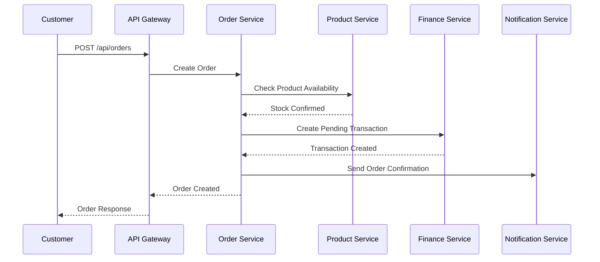
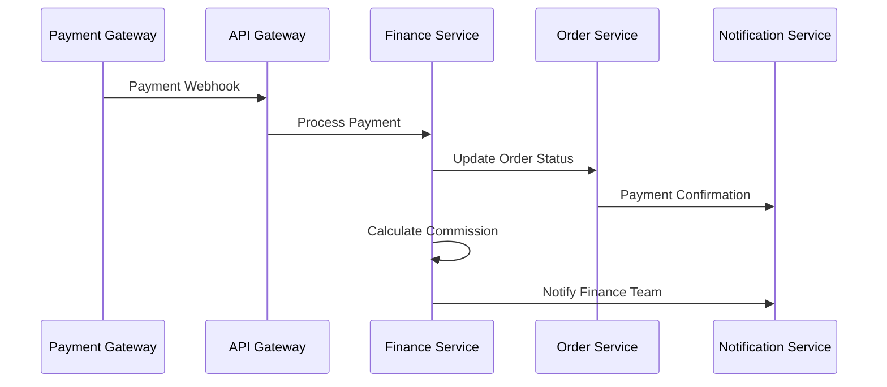
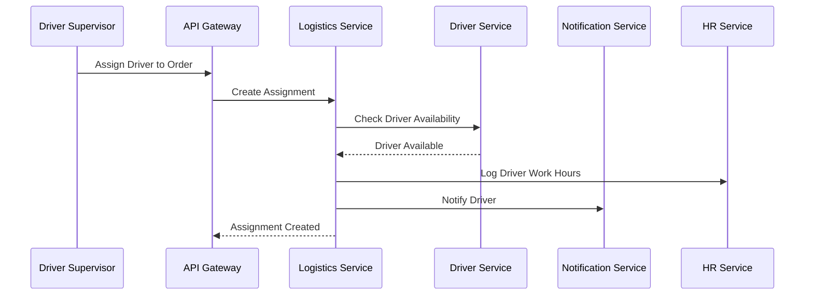
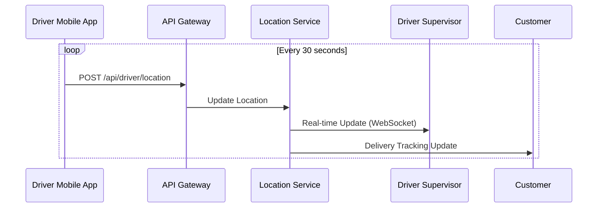
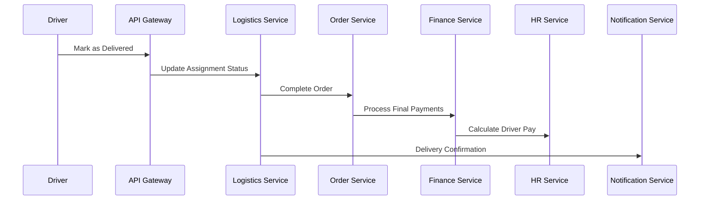
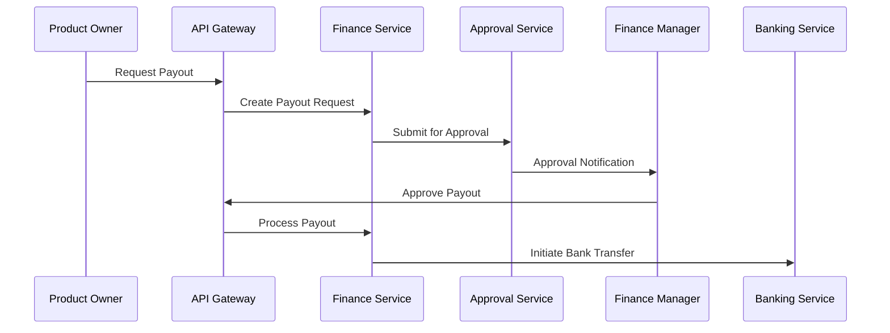
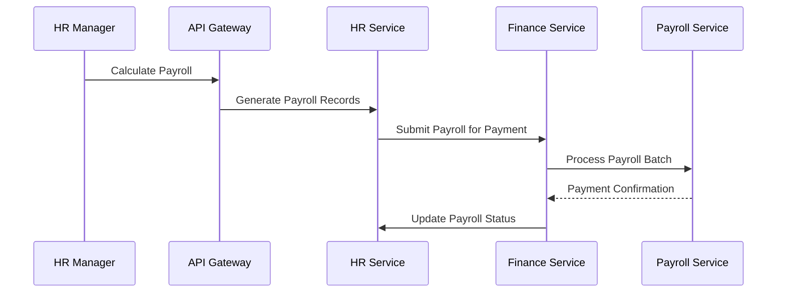

# Complete Data Flow Architecture

## Overview
This document explains how data flows through the 6-dashboard webstore platform, focusing on how a single order moves through the system and updates multiple dashboards simultaneously. The architecture supports Super Admin, IT/DevOps, HR, Driver Supervisor, Finance, and Product Owner dashboards with real-time synchronization.

## Core Data Flow Principles

### 1. Event-Driven Architecture
- **Domain Events**: Each significant business action triggers domain events
- **Event Sourcing**: Critical operations are stored as immutable events
- **Eventual Consistency**: Cross-dashboard updates happen asynchronously
- **Saga Pattern**: Complex workflows are managed through sagas

### 2. Transaction Boundaries
- **Single Database**: All operations within one database transaction when possible
- **Distributed Transactions**: Use 2PC for cross-service operations
- **Compensation**: Rollback mechanisms for failed distributed operations
- **Idempotency**: All operations are idempotent to handle retries

### 3. Real-Time Updates
- **WebSocket Connections**: Live updates to connected dashboards
- **Server-Sent Events**: One-way real-time notifications
- **Message Queues**: Asynchronous processing of heavy operations
- **Cache Invalidation**: Smart cache updates on data changes

## Complete Order Lifecycle Flow

### Phase 1: Order Creation

#### 1.1 Customer Places Order


**Database Operations:**
```sql
-- 1. Create order record
INSERT INTO orders (
    order_number, customer_id, store_id, status, 
    subtotal, tax_amount, total_amount, shipping_address
) VALUES (...);

-- 2. Create order items
INSERT INTO order_items (
    order_id, product_id, product_name, unit_price, quantity, total_price
) VALUES (...);

-- 3. Update product stock
UPDATE products 
SET stock_quantity = stock_quantity - :quantity 
WHERE id = :product_id AND stock_quantity >= :quantity;

-- 4. Create financial transaction
INSERT INTO financial_transactions (
    transaction_id, order_id, store_id, type, amount, status, description
) VALUES (
    :transaction_id, :order_id, :store_id, 'order_payment', :amount, 'pending', 'Order payment'
);

-- 5. Create audit log
INSERT INTO audit_logs (
    user_id, action, model_type, model_id, new_values, ip_address
) VALUES (:user_id, 'create', 'Order', :order_id, :order_data, :ip);
```

**Dashboard Updates:**
- **Product Owner Dashboard**: New order notification, inventory update
- **Finance Dashboard**: New pending transaction
- **Super Admin Dashboard**: Platform metrics update

#### 1.2 Payment Processing


**Database Operations:**
```sql
-- 1. Update financial transaction
UPDATE financial_transactions 
SET status = 'completed', 
    metadata = jsonb_set(metadata, '{payment_reference}', :payment_ref)
WHERE transaction_id = :transaction_id;

-- 2. Update order payment status
UPDATE orders 
SET payment_status = 'paid', 
    status = 'confirmed'
WHERE id = :order_id;

-- 3. Create commission transaction
INSERT INTO financial_transactions (
    transaction_id, order_id, store_id, type, amount, status, description
) VALUES (
    :commission_tx_id, :order_id, :store_id, 'commission', 
    :commission_amount, 'completed', 'Platform commission'
);

-- 4. Update store earnings
UPDATE stores 
SET total_earnings = total_earnings + (:order_total - :commission_amount)
WHERE id = :store_id;
```

**Dashboard Updates:**
- **Finance Dashboard**: Transaction completed, commission recorded
- **Product Owner Dashboard**: Earnings updated
- **Super Admin Dashboard**: Revenue metrics updated

### Phase 2: Order Processing & Assignment

#### 2.1 Driver Assignment


**Database Operations:**
```sql
-- 1. Create delivery assignment
INSERT INTO delivery_assignments (
    order_id, driver_id, assigned_by, status, assigned_at, delivery_fee
) VALUES (
    :order_id, :driver_id, :supervisor_id, 'assigned', NOW(), :delivery_fee
);

-- 2. Update driver availability
UPDATE drivers 
SET availability = 'busy', 
    total_deliveries = total_deliveries + 1
WHERE id = :driver_id;

-- 3. Update order status
UPDATE orders 
SET status = 'processing'
WHERE id = :order_id;

-- 4. Create shift record for driver
INSERT INTO shifts (
    employee_id, shift_date, start_time, status, notes
) VALUES (
    (SELECT employee_id FROM drivers WHERE id = :driver_id),
    CURRENT_DATE, CURRENT_TIME, 'in_progress', 'Delivery assignment'
);

-- 5. Create delivery fee transaction
INSERT INTO financial_transactions (
    transaction_id, order_id, type, amount, status, description
) VALUES (
    :delivery_tx_id, :order_id, 'expense', :delivery_fee, 'pending', 'Delivery fee'
);
```

**Dashboard Updates:**
- **Driver Supervisor Dashboard**: Assignment created, driver status updated
- **HR Dashboard**: Driver shift logged
- **Finance Dashboard**: Delivery expense recorded
- **Product Owner Dashboard**: Order status updated

#### 2.2 Real-Time Location Tracking


**Database Operations:**
```sql
-- 1. Insert location record
INSERT INTO driver_locations (
    driver_id, latitude, longitude, accuracy, speed, heading, recorded_at
) VALUES (
    :driver_id, :lat, :lng, :accuracy, :speed, :heading, NOW()
);

-- 2. Update driver current location (for quick queries)
UPDATE drivers 
SET last_location = point(:lng, :lat),
    last_location_update = NOW()
WHERE id = :driver_id;

-- 3. Clean old location data (keep last 24 hours)
DELETE FROM driver_locations 
WHERE driver_id = :driver_id 
AND recorded_at < NOW() - INTERVAL '24 hours';
```

**Dashboard Updates:**
- **Driver Supervisor Dashboard**: Live map updates
- **Customer Portal**: Delivery tracking updates

### Phase 3: Delivery & Completion

#### 3.1 Order Delivery


**Database Operations:**
```sql
-- 1. Update delivery assignment
UPDATE delivery_assignments 
SET status = 'delivered',
    delivered_at = NOW(),
    delivery_proof = :proof_data
WHERE order_id = :order_id;

-- 2. Update order status
UPDATE orders 
SET status = 'delivered',
    delivered_at = NOW()
WHERE id = :order_id;

-- 3. Update driver availability
UPDATE drivers 
SET availability = 'available'
WHERE id = :driver_id;

-- 4. Complete shift record
UPDATE shifts 
SET actual_end_time = CURRENT_TIME,
    hours_worked = EXTRACT(EPOCH FROM (CURRENT_TIME - actual_start_time))/3600,
    status = 'completed'
WHERE employee_id = (SELECT employee_id FROM drivers WHERE id = :driver_id)
AND shift_date = CURRENT_DATE
AND status = 'in_progress';

-- 5. Process driver payment
INSERT INTO financial_transactions (
    transaction_id, user_id, type, amount, status, description
) VALUES (
    :driver_payment_tx_id, :driver_user_id, 'payroll', :delivery_fee, 'completed', 'Delivery payment'
);

-- 6. Lock financial transactions (immutability)
UPDATE financial_transactions 
SET is_locked = TRUE, 
    locked_at = NOW(),
    hash = md5(concat(id, amount, created_at))
WHERE order_id = :order_id;
```

**Dashboard Updates:**
- **Driver Supervisor Dashboard**: Delivery completed, driver available
- **Product Owner Dashboard**: Order delivered, earnings finalized
- **Finance Dashboard**: All transactions locked and completed
- **HR Dashboard**: Driver shift completed, hours logged
- **Customer Portal**: Delivery confirmation

### Phase 4: Financial Settlement

#### 4.1 Payout Request (Product Owner)


**Database Operations:**
```sql
-- 1. Create payout request
INSERT INTO payouts (
    store_id, requested_by, amount, currency, bank_details, notes
) VALUES (
    :store_id, :user_id, :amount, 'USD', :bank_details, :notes
);

-- 2. Create approval transaction
INSERT INTO financial_transactions (
    transaction_id, store_id, type, amount, status, approval_status, description
) VALUES (
    :payout_tx_id, :store_id, 'payout', :amount, 'pending', 'pending', 'Store payout request'
);

-- 3. Update store balance
UPDATE stores 
SET pending_payout = pending_payout + :amount,
    available_balance = available_balance - :amount
WHERE id = :store_id;
```

#### 4.2 Payroll Processing (HR to Finance)


**Database Operations:**
```sql
-- 1. Calculate payroll for period
INSERT INTO payroll_records (
    employee_id, pay_period, regular_hours, overtime_hours, 
    regular_pay, overtime_pay, gross_pay, net_pay
)
SELECT 
    e.id,
    :pay_period,
    COALESCE(SUM(s.hours_worked), 0) as regular_hours,
    COALESCE(SUM(s.overtime_hours), 0) as overtime_hours,
    COALESCE(SUM(s.hours_worked), 0) * e.hourly_rate as regular_pay,
    COALESCE(SUM(s.overtime_hours), 0) * e.hourly_rate * 1.5 as overtime_pay,
    (COALESCE(SUM(s.hours_worked), 0) * e.hourly_rate) + 
    (COALESCE(SUM(s.overtime_hours), 0) * e.hourly_rate * 1.5) as gross_pay,
    ((COALESCE(SUM(s.hours_worked), 0) * e.hourly_rate) + 
     (COALESCE(SUM(s.overtime_hours), 0) * e.hourly_rate * 1.5)) * 0.85 as net_pay
FROM employees e
LEFT JOIN shifts s ON e.id = s.employee_id 
    AND s.shift_date BETWEEN :period_start AND :period_end
    AND s.status = 'completed'
WHERE e.status = 'active'
GROUP BY e.id, e.hourly_rate;

-- 2. Create payroll transactions
INSERT INTO financial_transactions (
    transaction_id, user_id, type, amount, status, description
)
SELECT 
    concat('payroll_', pr.id, '_', extract(epoch from now())),
    e.user_id,
    'payroll',
    pr.net_pay,
    'pending',
    concat('Payroll for ', pr.pay_period)
FROM payroll_records pr
JOIN employees e ON pr.employee_id = e.id
WHERE pr.pay_period = :pay_period
AND pr.status = 'draft';
```

**Dashboard Updates:**
- **HR Dashboard**: Payroll calculated and submitted
- **Finance Dashboard**: Payroll expenses pending approval
- **Super Admin Dashboard**: Payroll costs in financial overview

## Cross-Dashboard Data Synchronization

### 1. Real-Time Event Broadcasting

```javascript
// Event Broadcasting Service
class EventBroadcaster {
    async broadcastOrderUpdate(orderId, eventType, data) {
        const event = {
            type: eventType,
            orderId: orderId,
            data: data,
            timestamp: new Date().toISOString()
        };
        
        // Broadcast to relevant dashboards
        await Promise.all([
            this.notifyProductOwner(event),
            this.notifyDriverSupervisor(event),
            this.notifyFinance(event),
            this.notifyAdmin(event)
        ]);
    }
    
    async notifyProductOwner(event) {
        const storeId = event.data.storeId;
        await this.websocket.send(`store:${storeId}`, event);
    }
    
    async notifyDriverSupervisor(event) {
        if (event.type === 'order.assigned' || event.type === 'order.delivered') {
            await this.websocket.send('supervisor:deliveries', event);
        }
    }
    
    async notifyFinance(event) {
        if (event.type.includes('payment') || event.type.includes('payout')) {
            await this.websocket.send('finance:transactions', event);
        }
    }
}
```

### 2. Database Triggers for Consistency

```sql
-- Trigger to update store metrics when order is completed
CREATE OR REPLACE FUNCTION update_store_metrics()
RETURNS TRIGGER AS $$
BEGIN
    IF NEW.status = 'delivered' AND OLD.status != 'delivered' THEN
        UPDATE stores 
        SET total_orders = total_orders + 1,
            total_revenue = total_revenue + NEW.total_amount,
            last_order_at = NOW()
        WHERE id = NEW.store_id;
    END IF;
    
    RETURN NEW;
END;
$$ LANGUAGE plpgsql;

CREATE TRIGGER order_completion_trigger
    AFTER UPDATE ON orders
    FOR EACH ROW
    EXECUTE FUNCTION update_store_metrics();

-- Trigger to create audit logs automatically
CREATE OR REPLACE FUNCTION create_audit_log()
RETURNS TRIGGER AS $$
BEGIN
    INSERT INTO audit_logs (
        user_id, action, model_type, model_id, old_values, new_values
    ) VALUES (
        current_setting('app.current_user_id', true)::bigint,
        TG_OP,
        TG_TABLE_NAME,
        COALESCE(NEW.id, OLD.id),
        CASE WHEN TG_OP = 'DELETE' THEN row_to_json(OLD) ELSE NULL END,
        CASE WHEN TG_OP != 'DELETE' THEN row_to_json(NEW) ELSE NULL END
    );
    
    RETURN COALESCE(NEW, OLD);
END;
$$ LANGUAGE plpgsql;

-- Apply audit trigger to critical tables
CREATE TRIGGER audit_orders_trigger
    AFTER INSERT OR UPDATE OR DELETE ON orders
    FOR EACH ROW EXECUTE FUNCTION create_audit_log();

CREATE TRIGGER audit_financial_transactions_trigger
    AFTER INSERT OR UPDATE OR DELETE ON financial_transactions
    FOR EACH ROW EXECUTE FUNCTION create_audit_log();
```

### 3. Cache Invalidation Strategy

```javascript
// Cache Invalidation Service
class CacheInvalidator {
    async invalidateOrderRelatedCaches(orderId, storeId, customerId) {
        const cacheKeys = [
            `orders:${orderId}`,
            `store:${storeId}:orders`,
            `store:${storeId}:analytics`,
            `customer:${customerId}:orders`,
            `dashboard:admin:metrics`,
            `dashboard:finance:transactions`
        ];
        
        await Promise.all(
            cacheKeys.map(key => this.redis.del(key))
        );
    }
    
    async invalidateDriverCaches(driverId) {
        const cacheKeys = [
            `driver:${driverId}:location`,
            `driver:${driverId}:assignments`,
            `dashboard:supervisor:drivers`,
            `dashboard:supervisor:map`
        ];
        
        await Promise.all(
            cacheKeys.map(key => this.redis.del(key))
        );
    }
}
```

## Performance Optimization Strategies

### 1. Read Replicas for Dashboard Queries
```sql
-- Dashboard queries use read replicas
-- Master: Write operations (orders, payments, updates)
-- Replica 1: Product Owner dashboard queries
-- Replica 2: Admin and Finance dashboard queries
-- Replica 3: HR and Supervisor dashboard queries
```

### 2. Materialized Views for Analytics
```sql
-- Daily sales summary (refreshed hourly)
CREATE MATERIALIZED VIEW daily_sales_summary AS
SELECT 
    DATE(created_at) as sale_date,
    store_id,
    COUNT(*) as total_orders,
    SUM(total_amount) as total_revenue,
    AVG(total_amount) as avg_order_value
FROM orders 
WHERE status = 'delivered'
GROUP BY DATE(created_at), store_id;

-- Refresh strategy
CREATE OR REPLACE FUNCTION refresh_sales_summary()
RETURNS void AS $$
BEGIN
    REFRESH MATERIALIZED VIEW CONCURRENTLY daily_sales_summary;
END;
$$ LANGUAGE plpgsql;

-- Schedule refresh every hour
SELECT cron.schedule('refresh-sales-summary', '0 * * * *', 'SELECT refresh_sales_summary();');
```

### 3. Event Sourcing for Critical Operations
```sql
-- Event store for financial operations
CREATE TABLE financial_events (
    id BIGSERIAL PRIMARY KEY,
    aggregate_id BIGINT NOT NULL,
    aggregate_type VARCHAR(50) NOT NULL,
    event_type VARCHAR(100) NOT NULL,
    event_data JSON NOT NULL,
    event_version INTEGER NOT NULL,
    created_at TIMESTAMP DEFAULT NOW(),
    created_by BIGINT REFERENCES users(id)
);

-- Example events:
-- PaymentInitiated, PaymentCompleted, PaymentFailed
-- PayoutRequested, PayoutApproved, PayoutProcessed
-- CommissionCalculated, CommissionPaid
```

## Error Handling & Recovery

### 1. Distributed Transaction Rollback
```javascript
// Saga pattern for order processing
class OrderProcessingSaga {
    async execute(orderData) {
        const saga = new Saga();
        
        try {
            // Step 1: Create order
            const order = await saga.step(
                () => this.orderService.createOrder(orderData),
                (order) => this.orderService.cancelOrder(order.id)
            );
            
            // Step 2: Process payment
            const payment = await saga.step(
                () => this.paymentService.processPayment(order.id),
                (payment) => this.paymentService.refundPayment(payment.id)
            );
            
            // Step 3: Update inventory
            await saga.step(
                () => this.inventoryService.reserveStock(order.items),
                () => this.inventoryService.releaseStock(order.items)
            );
            
            // Step 4: Create financial records
            await saga.step(
                () => this.financeService.createTransactions(order),
                () => this.financeService.reverseTransactions(order.id)
            );
            
            return order;
            
        } catch (error) {
            await saga.rollback();
            throw error;
        }
    }
}
```

### 2. Data Consistency Checks
```sql
-- Scheduled consistency checks
CREATE OR REPLACE FUNCTION check_financial_consistency()
RETURNS TABLE(issue_type TEXT, details JSON) AS $$
BEGIN
    -- Check if order totals match transaction amounts
    RETURN QUERY
    SELECT 
        'order_transaction_mismatch'::TEXT,
        json_build_object(
            'order_id', o.id,
            'order_total', o.total_amount,
            'transaction_total', COALESCE(SUM(ft.amount), 0)
        )
    FROM orders o
    LEFT JOIN financial_transactions ft ON o.id = ft.order_id 
        AND ft.type = 'order_payment' 
        AND ft.status = 'completed'
    WHERE o.payment_status = 'paid'
    GROUP BY o.id, o.total_amount
    HAVING o.total_amount != COALESCE(SUM(ft.amount), 0);
    
    -- Check for orphaned transactions
    RETURN QUERY
    SELECT 
        'orphaned_transaction'::TEXT,
        json_build_object(
            'transaction_id', ft.id,
            'order_id', ft.order_id
        )
    FROM financial_transactions ft
    LEFT JOIN orders o ON ft.order_id = o.id
    WHERE ft.order_id IS NOT NULL 
    AND o.id IS NULL;
END;
$$ LANGUAGE plpgsql;
```

This comprehensive data flow ensures that all dashboards stay synchronized while maintaining data integrity and providing real-time updates to users across the platform.

## Complete Order Lifecycle with 6-Dashboard Integration

### Phase 1: Order Creation & Initial Processing

#### 1.1 Customer Places Order
When a customer places an order, the system triggers a cascade of updates across all relevant dashboards:

**Database Operations:**
```sql
-- Transaction begins
BEGIN;

-- 1. Create order record
INSERT INTO orders (
    order_number, customer_id, store_id, status, 
    subtotal, tax_amount, total_amount, shipping_address,
    commission_amount
) VALUES (
    :order_number, :customer_id, :store_id, 'pending',
    :subtotal, :tax_amount, :total_amount, :shipping_address,
    :subtotal * (SELECT commission_rate FROM stores WHERE id = :store_id)
);

-- 2. Create order items with product snapshots
INSERT INTO order_items (
    order_id, product_id, product_name, product_sku, 
    unit_price, quantity, total_price, product_snapshot
) VALUES (
    :order_id, :product_id, :product_name, :product_sku,
    :unit_price, :quantity, :unit_price * :quantity,
    (SELECT row_to_json(p) FROM products p WHERE p.id = :product_id)
);

-- 3. Update product stock atomically
UPDATE products 
SET stock_quantity = stock_quantity - :quantity,
    updated_at = NOW()
WHERE id = :product_id 
AND stock_quantity >= :quantity;

-- 4. Create financial transaction for order payment
INSERT INTO financial_transactions (
    transaction_id, order_id, store_id, user_id, type, 
    amount, status, description, metadata
) VALUES (
    :payment_tx_id, :order_id, :store_id, :customer_id, 'order_payment',
    :total_amount, 'pending', 'Order payment', 
    json_build_object('order_number', :order_number, 'payment_method', :payment_method)
);

-- 5. Create commission transaction
INSERT INTO financial_transactions (
    transaction_id, order_id, store_id, type, 
    amount, status, description
) VALUES (
    :commission_tx_id, :order_id, :store_id, 'commission',
    :commission_amount, 'pending', 'Platform commission'
);

-- 6. Calculate and record tax
INSERT INTO tax_calculations (
    order_id, tax_type, tax_rate, taxable_amount, tax_amount
) VALUES (
    :order_id, 'vat', :tax_rate, :subtotal, :tax_amount
);

-- 7. Create audit log
INSERT INTO audit_logs (
    user_id, action, model_type, model_id, new_values, ip_address
) VALUES (
    :customer_id, 'create', 'Order', :order_id, 
    json_build_object('order_number', :order_number, 'total', :total_amount),
    :ip_address
);

-- 8. Update daily analytics
INSERT INTO daily_analytics (
    analytics_date, metric_type, dimension, dimension_value, metric_value
) VALUES 
    (CURRENT_DATE, 'orders_count', 'store_id', :store_id, 1),
    (CURRENT_DATE, 'revenue', 'store_id', :store_id, :total_amount),
    (CURRENT_DATE, 'commission', 'platform', 'total', :commission_amount)
ON CONFLICT (analytics_date, metric_type, dimension, dimension_value) 
DO UPDATE SET 
    metric_value = daily_analytics.metric_value + EXCLUDED.metric_value,
    calculated_at = NOW();

COMMIT;
```

**Real-time Dashboard Updates:**
```javascript
// Event Broadcasting to All Dashboards
const orderEvent = {
    type: 'order.created',
    orderId: order.id,
    storeId: order.store_id,
    customerId: order.customer_id,
    amount: order.total_amount,
    timestamp: new Date().toISOString()
};

// Super Admin Dashboard - Platform metrics update
websocket.send('admin:global', {
    ...orderEvent,
    metrics: {
        totalOrders: await getTotalOrders(),
        dailyRevenue: await getDailyRevenue(),
        activeStores: await getActiveStores()
    }
});

// Product Owner Dashboard - New order notification
websocket.send(`vendor:${order.store_id}`, {
    ...orderEvent,
    orderDetails: order,
    inventoryUpdate: {
        productId: orderItem.product_id,
        newStock: updatedStock
    }
});

// Finance Dashboard - New transaction
websocket.send('finance:transactions', {
    ...orderEvent,
    transactions: [paymentTransaction, commissionTransaction],
    taxCalculation: taxData
});

// IT Dashboard - System metrics
websocket.send('devops:metrics', {
    type: 'system.activity',
    apiEndpoint: '/api/orders',
    responseTime: responseTime,
    timestamp: new Date().toISOString()
});
```

### Phase 2: Payment Processing & Order Confirmation

#### 2.1 Payment Gateway Integration
```sql
-- Payment webhook processing
BEGIN;

-- 1. Update payment transaction
UPDATE financial_transactions 
SET status = 'completed',
    metadata = jsonb_set(
        metadata, 
        '{payment_reference}', 
        to_jsonb(:payment_reference)
    ),
    approved_at = NOW()
WHERE transaction_id = :payment_tx_id;

-- 2. Update order status
UPDATE orders 
SET payment_status = 'paid',
    status = 'confirmed',
    updated_at = NOW()
WHERE id = :order_id;

-- 3. Complete commission transaction
UPDATE financial_transactions 
SET status = 'completed',
    approved_at = NOW()
WHERE transaction_id = :commission_tx_id;

-- 4. Update store earnings
UPDATE stores 
SET total_earnings = total_earnings + (:total_amount - :commission_amount),
    available_balance = available_balance + (:total_amount - :commission_amount),
    total_orders = total_orders + 1,
    last_order_at = NOW()
WHERE id = :store_id;

-- 5. Lock financial transactions for immutability
UPDATE financial_transactions 
SET is_locked = TRUE,
    locked_at = NOW(),
    hash = md5(concat(id, amount, status, created_at))
WHERE order_id = :order_id;

COMMIT;
```

### Phase 3: Driver Assignment & Logistics

#### 3.1 Order Assignment to Driver (Driver Supervisor Dashboard)
```sql
-- Driver assignment process
BEGIN;

-- 1. Create delivery assignment
INSERT INTO delivery_assignments (
    order_id, driver_id, assigned_by, status, 
    assigned_at, delivery_fee
) VALUES (
    :order_id, :driver_id, :supervisor_id, 'assigned',
    NOW(), :delivery_fee
);

-- 2. Update driver status
UPDATE drivers 
SET availability = 'busy',
    total_deliveries = total_deliveries + 1,
    last_location_update = NOW()
WHERE id = :driver_id;

-- 3. Update order status
UPDATE orders 
SET status = 'processing',
    updated_at = NOW()
WHERE id = :order_id;

-- 4. Create shift record for driver
INSERT INTO shifts (
    employee_id, shift_date, start_time, status, notes
) VALUES (
    (SELECT employee_id FROM drivers d 
     JOIN employees e ON d.user_id = e.user_id 
     WHERE d.id = :driver_id),
    CURRENT_DATE, CURRENT_TIME, 'in_progress', 
    concat('Delivery assignment for order ', :order_number)
);

-- 5. Create delivery expense transaction
INSERT INTO financial_transactions (
    transaction_id, order_id, type, amount, status, description
) VALUES (
    :delivery_tx_id, :order_id, 'expense', :delivery_fee, 
    'pending', 'Delivery fee expense'
);

-- 6. Create optimized route
INSERT INTO delivery_routes (
    driver_id, route_date, waypoints, optimized_sequence, status
) VALUES (
    :driver_id, CURRENT_DATE, :waypoints, :optimized_sequence, 'active'
);

COMMIT;
```

**Dashboard Updates:**
```javascript
// Driver Supervisor Dashboard
websocket.send('supervisor:assignments', {
    type: 'assignment.created',
    assignmentId: assignment.id,
    driverId: driver.id,
    orderId: order.id,
    route: optimizedRoute
});

// HR Dashboard - Driver shift logged
websocket.send('hr:shifts', {
    type: 'shift.started',
    employeeId: employee.id,
    shiftId: shift.id,
    startTime: shift.start_time
});

// Finance Dashboard - Delivery expense
websocket.send('finance:expenses', {
    type: 'expense.created',
    transactionId: deliveryTransaction.id,
    amount: delivery_fee,
    category: 'delivery'
});
```

#### 3.2 Real-time Location Tracking
```sql
-- Location update from driver mobile app
INSERT INTO driver_locations (
    driver_id, latitude, longitude, accuracy, 
    speed, heading, recorded_at
) VALUES (
    :driver_id, :lat, :lng, :accuracy, 
    :speed, :heading, NOW()
);

-- Update driver current location for quick queries
UPDATE drivers 
SET last_location = point(:lng, :lat),
    last_location_update = NOW(),
    current_speed = :speed,
    current_heading = :heading
WHERE id = :driver_id;

-- Clean old location data (keep last 24 hours)
DELETE FROM driver_locations 
WHERE driver_id = :driver_id 
AND recorded_at < NOW() - INTERVAL '24 hours';
```

### Phase 4: Delivery Completion & Financial Settlement

#### 4.1 Order Delivery
```sql
-- Delivery completion process
BEGIN;

-- 1. Update delivery assignment
UPDATE delivery_assignments 
SET status = 'delivered',
    delivered_at = NOW(),
    delivery_proof = :proof_data
WHERE order_id = :order_id;

-- 2. Complete order
UPDATE orders 
SET status = 'delivered',
    delivered_at = NOW()
WHERE id = :order_id;

-- 3. Update driver availability
UPDATE drivers 
SET availability = 'available'
WHERE id = :driver_id;

-- 4. Complete driver shift
UPDATE shifts 
SET actual_end_time = CURRENT_TIME,
    hours_worked = EXTRACT(EPOCH FROM (CURRENT_TIME - actual_start_time))/3600,
    status = 'completed'
WHERE employee_id = (
    SELECT e.id FROM drivers d 
    JOIN employees e ON d.user_id = e.user_id 
    WHERE d.id = :driver_id
) AND shift_date = CURRENT_DATE AND status = 'in_progress';

-- 5. Process driver payment
INSERT INTO financial_transactions (
    transaction_id, user_id, type, amount, status, description
) VALUES (
    :driver_payment_tx_id, :driver_user_id, 'payroll', 
    :delivery_fee, 'completed', 'Delivery payment'
);

-- 6. Complete delivery route
UPDATE delivery_routes 
SET status = 'completed',
    completed_at = NOW()
WHERE driver_id = :driver_id 
AND route_date = CURRENT_DATE 
AND status = 'active';

COMMIT;
```

### Phase 5: Payroll Processing (HR to Finance)

#### 5.1 HR Calculates Payroll
```sql
-- Calculate payroll for pay period
INSERT INTO payroll_records (
    employee_id, pay_period, regular_hours, overtime_hours,
    regular_pay, overtime_pay, gross_pay, net_pay, status
)
SELECT 
    e.id as employee_id,
    :pay_period,
    COALESCE(SUM(CASE WHEN s.hours_worked <= 40 THEN s.hours_worked ELSE 40 END), 0) as regular_hours,
    COALESCE(SUM(CASE WHEN s.hours_worked > 40 THEN s.hours_worked - 40 ELSE 0 END), 0) as overtime_hours,
    COALESCE(SUM(CASE WHEN s.hours_worked <= 40 THEN s.hours_worked ELSE 40 END), 0) * 
        COALESCE(e.hourly_rate, e.monthly_salary/160) as regular_pay,
    COALESCE(SUM(CASE WHEN s.hours_worked > 40 THEN s.hours_worked - 40 ELSE 0 END), 0) * 
        COALESCE(e.hourly_rate, e.monthly_salary/160) * 1.5 as overtime_pay,
    (COALESCE(SUM(CASE WHEN s.hours_worked <= 40 THEN s.hours_worked ELSE 40 END), 0) * 
     COALESCE(e.hourly_rate, e.monthly_salary/160)) +
    (COALESCE(SUM(CASE WHEN s.hours_worked > 40 THEN s.hours_worked - 40 ELSE 0 END), 0) * 
     COALESCE(e.hourly_rate, e.monthly_salary/160) * 1.5) as gross_pay,
    ((COALESCE(SUM(CASE WHEN s.hours_worked <= 40 THEN s.hours_worked ELSE 40 END), 0) * 
      COALESCE(e.hourly_rate, e.monthly_salary/160)) +
     (COALESCE(SUM(CASE WHEN s.hours_worked > 40 THEN s.hours_worked - 40 ELSE 0 END), 0) * 
      COALESCE(e.hourly_rate, e.monthly_salary/160) * 1.5)) * 0.85 as net_pay,
    'draft' as status
FROM employees e
LEFT JOIN shifts s ON e.id = s.employee_id 
    AND s.shift_date BETWEEN :period_start AND :period_end
    AND s.status = 'completed'
WHERE e.status = 'active'
GROUP BY e.id, e.hourly_rate, e.monthly_salary;
```

#### 5.2 Finance Processes Payroll
```sql
-- Finance approves and processes payroll
BEGIN;

-- 1. Approve payroll records
UPDATE payroll_records 
SET status = 'approved',
    approved_by = :finance_manager_id,
    approved_at = NOW()
WHERE pay_period = :pay_period 
AND status = 'draft';

-- 2. Create payroll transactions
INSERT INTO financial_transactions (
    transaction_id, user_id, type, amount, status, description, metadata
)
SELECT 
    concat('payroll_', pr.id, '_', extract(epoch from now())),
    e.user_id,
    'payroll',
    pr.net_pay,
    'completed',
    concat('Payroll for ', pr.pay_period),
    json_build_object(
        'payroll_record_id', pr.id,
        'regular_hours', pr.regular_hours,
        'overtime_hours', pr.overtime_hours,
        'gross_pay', pr.gross_pay
    )
FROM payroll_records pr
JOIN employees e ON pr.employee_id = e.id
WHERE pr.pay_period = :pay_period
AND pr.status = 'approved';

-- 3. Update payroll status
UPDATE payroll_records 
SET status = 'paid'
WHERE pay_period = :pay_period 
AND status = 'approved';

COMMIT;
```

### Phase 6: Vendor Payout Requests

#### 6.1 Product Owner Requests Payout
```sql
-- Vendor payout request
BEGIN;

-- 1. Validate available balance
SELECT available_balance 
FROM stores 
WHERE id = :store_id 
AND available_balance >= :requested_amount
FOR UPDATE;

-- 2. Create payout request
INSERT INTO payouts (
    store_id, requested_by, amount, currency, 
    bank_details, notes, status
) VALUES (
    :store_id, :vendor_user_id, :amount, 'USD',
    :bank_details, :notes, 'pending'
);

-- 3. Create payout transaction
INSERT INTO financial_transactions (
    transaction_id, store_id, user_id, type, amount, 
    status, approval_status, description
) VALUES (
    :payout_tx_id, :store_id, :vendor_user_id, 'payout', 
    :amount, 'pending', 'pending', 'Store payout request'
);

-- 4. Update store balance
UPDATE stores 
SET pending_payout = pending_payout + :amount,
    available_balance = available_balance - :amount
WHERE id = :store_id;

COMMIT;
```

#### 6.2 Finance Approves and Processes Payout
```sql
-- Finance payout approval and processing
BEGIN;

-- 1. Approve payout
UPDATE payouts 
SET status = 'approved',
    processed_by = :finance_manager_id,
    processed_at = NOW()
WHERE id = :payout_id;

-- 2. Update transaction status
UPDATE financial_transactions 
SET status = 'processing',
    approval_status = 'approved',
    approved_by = :finance_manager_id,
    approved_at = NOW()
WHERE transaction_id = :payout_tx_id;

-- 3. Process bank transfer (external API call)
-- This would integrate with banking API

-- 4. Complete payout
UPDATE payouts 
SET status = 'completed',
    reference_number = :bank_reference
WHERE id = :payout_id;

-- 5. Complete transaction
UPDATE financial_transactions 
SET status = 'completed'
WHERE transaction_id = :payout_tx_id;

-- 6. Update store balance
UPDATE stores 
SET pending_payout = pending_payout - :amount
WHERE id = :store_id;

COMMIT;
```

## Cross-Dashboard Real-time Synchronization

### 1. Event-Driven Architecture
```javascript
class DashboardEventBroadcaster {
    constructor() {
        this.connections = new Map();
        this.redis = new Redis();
    }

    // Subscribe dashboard to specific event channels
    subscribeDashboard(dashboardType, userId, websocket) {
        const channels = this.getDashboardChannels(dashboardType, userId);
        
        channels.forEach(channel => {
            if (!this.connections.has(channel)) {
                this.connections.set(channel, new Set());
            }
            this.connections.get(channel).add({
                dashboardType,
                userId,
                websocket
            });
        });
    }

    // Get relevant channels for each dashboard type
    getDashboardChannels(dashboardType, userId) {
        const baseChannels = [`${dashboardType}:global`];
        
        switch (dashboardType) {
            case 'admin':
                return [...baseChannels, 'system:alerts', 'platform:metrics'];
            
            case 'devops':
                return [...baseChannels, 'system:health', 'api:errors', 'deployments:status'];
            
            case 'hr':
                return [...baseChannels, 'employees:updates', 'shifts:changes', 'payroll:status'];
            
            case 'supervisor':
                return [...baseChannels, 'drivers:locations', 'deliveries:updates', 'routes:changes'];
            
            case 'finance':
                return [...baseChannels, 'transactions:updates', 'payouts:requests', 'revenue:changes'];
            
            case 'vendor':
                const storeId = this.getUserStoreId(userId);
                return [...baseChannels, `store:${storeId}:orders`, `store:${storeId}:earnings`];
            
            default:
                return baseChannels;
        }
    }

    // Broadcast event to relevant dashboards
    async broadcastEvent(eventType, data) {
        const relevantChannels = this.getEventChannels(eventType);
        
        for (const channel of relevantChannels) {
            const connections = this.connections.get(channel);
            if (connections) {
                const event = {
                    type: eventType,
                    data: data,
                    timestamp: new Date().toISOString(),
                    channel: channel
                };
                
                connections.forEach(connection => {
                    if (connection.websocket.readyState === WebSocket.OPEN) {
                        connection.websocket.send(JSON.stringify(event));
                    }
                });
            }
        }
        
        // Also publish to Redis for horizontal scaling
        await this.redis.publish('dashboard_events', JSON.stringify({
            eventType,
            data,
            channels: relevantChannels
        }));
    }
}
```

### 2. Database Triggers for Automatic Updates
```sql
-- Trigger for order status changes
CREATE OR REPLACE FUNCTION notify_order_status_change()
RETURNS TRIGGER AS $$
BEGIN
    -- Notify relevant dashboards
    PERFORM pg_notify('order_status_changed', json_build_object(
        'order_id', NEW.id,
        'old_status', OLD.status,
        'new_status', NEW.status,
        'store_id', NEW.store_id,
        'customer_id', NEW.customer_id
    )::text);
    
    -- Update analytics
    IF NEW.status = 'delivered' AND OLD.status != 'delivered' THEN
        INSERT INTO daily_analytics (
            analytics_date, metric_type, dimension, dimension_value, metric_value
        ) VALUES 
            (CURRENT_DATE, 'delivered_orders', 'store_id', NEW.store_id::text, 1),
            (CURRENT_DATE, 'delivered_revenue', 'store_id', NEW.store_id::text, NEW.total_amount)
        ON CONFLICT (analytics_date, metric_type, dimension, dimension_value) 
        DO UPDATE SET 
            metric_value = daily_analytics.metric_value + EXCLUDED.metric_value;
    END IF;
    
    RETURN NEW;
END;
$$ LANGUAGE plpgsql;

CREATE TRIGGER order_status_change_trigger
    AFTER UPDATE ON orders
    FOR EACH ROW
    WHEN (OLD.status IS DISTINCT FROM NEW.status)
    EXECUTE FUNCTION notify_order_status_change();

-- Trigger for financial transaction approvals
CREATE OR REPLACE FUNCTION notify_transaction_approval()
RETURNS TRIGGER AS $$
BEGIN
    IF NEW.approval_status = 'approved' AND OLD.approval_status = 'pending' THEN
        PERFORM pg_notify('transaction_approved', json_build_object(
            'transaction_id', NEW.id,
            'type', NEW.type,
            'amount', NEW.amount,
            'store_id', NEW.store_id,
            'approved_by', NEW.approved_by
        )::text);
    END IF;
    
    RETURN NEW;
END;
$$ LANGUAGE plpgsql;

CREATE TRIGGER transaction_approval_trigger
    AFTER UPDATE ON financial_transactions
    FOR EACH ROW
    EXECUTE FUNCTION notify_transaction_approval();
```

### 3. Performance Optimization with Caching
```javascript
class DashboardCacheManager {
    constructor() {
        this.redis = new Redis();
        this.cacheTTL = {
            'admin:metrics': 300,      // 5 minutes
            'finance:summary': 600,    // 10 minutes
            'vendor:analytics': 900,   // 15 minutes
            'hr:reports': 1800,        // 30 minutes
            'supervisor:routes': 60    // 1 minute
        };
    }

    async getCachedData(dashboardType, cacheKey, dataFetcher) {
        const fullKey = `${dashboardType}:${cacheKey}`;
        
        // Try to get from cache first
        let cachedData = await this.redis.get(fullKey);
        if (cachedData) {
            return JSON.parse(cachedData);
        }
        
        // Fetch fresh data
        const freshData = await dataFetcher();
        
        // Cache the data
        const ttl = this.cacheTTL[dashboardType] || 300;
        await this.redis.setex(fullKey, ttl, JSON.stringify(freshData));
        
        return freshData;
    }

    async invalidateCache(pattern) {
        const keys = await this.redis.keys(pattern);
        if (keys.length > 0) {
            await this.redis.del(...keys);
        }
    }

    // Invalidate related caches when data changes
    async invalidateRelatedCaches(eventType, data) {
        const invalidationMap = {
            'order.created': [
                'admin:metrics*',
                'finance:summary*',
                `vendor:${data.storeId}:*`
            ],
            'payment.completed': [
                'finance:*',
                'admin:revenue*',
                `vendor:${data.storeId}:earnings*`
            ],
            'driver.assigned': [
                'supervisor:*',
                'hr:shifts*'
            ]
        };

        const patterns = invalidationMap[eventType] || [];
        for (const pattern of patterns) {
            await this.invalidateCache(pattern);
        }
    }
}
```

This comprehensive data flow architecture ensures that all 6 dashboards stay synchronized in real-time while maintaining data integrity, performance, and scalability. The system uses event-driven architecture, database triggers, caching strategies, and WebSocket connections to provide seamless user experiences across all dashboard types.